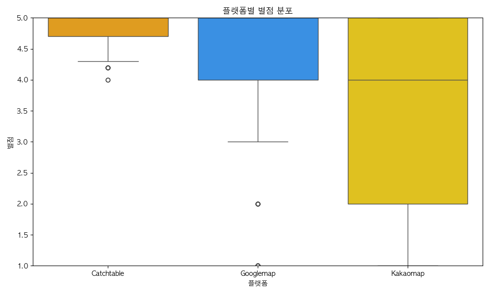

### 팀 소개

짱짱팀입니당~^^

## 이하람

- 컴퓨터과학과 24학번  
- MBTI: ISTJ  
- 좋아하는 것: 피아노, 밴드, 뜨개질, 문학, 차, 만년필, 뜨개질, 이외 다수… 취미부자…  
- 기타: 국제캠퍼스 무악하우스 RA(25-1, 2), 모르고리즘 운영진, 신촌ICPC 2025-s 운영진, RCM/관설차회 등 소속  
- 특이사항: 아직 뭘 할지 잘 모르겠다…!!

## 김현수

- 응용통계학과 23학번
- MBTI: INTJ (1년 전까진 INFJ)
- 특기: 일 벌리기, 취미: 일 미루기

## 조재관

- 컴퓨터과학과 21학번  
- MBTI: ENTP(INTP)  
- 좋아하는 것: 운동(축구, 약구, 헬스, 러닝 등등), 여행

---

### 코드 실행 방법

## Web

1. 가상환경(venv) 만들기 및 활성화 

```
python -m venv venv
venv\Scripts\activate # Windows
source venv/bin/activate # Mac/Linux
````

2. 디렉토리로 이동 > 필요 패키지 설치

```
pip install -r requirements.txt
```

3. FastAPI 앱 실행

```
uvicorn app.main:app --reload
```

4. 웹 브라우저 접속

* `http://localhost:8000` 
* `http://localhost:8000/static/index.html` 

5. API 테스트 (예: 로그인 등)

* `http://localhost:8000/api/user/login` 같은 API 엔드포인트에 POST 요청 보내서 테스트 가능

---

## 크롤링

```
YBIGTA_newbie_team_project
├── README.md # 읽어주세요...
│
├── database/
│ ├── reviews_{사이트 이름}.csv
│ └──
...
│
├── review_analysis/
│ ├── crawling/
│ │ ├── base_crawler.py
│ │ ├── main.py
│ │ └──
...
│ └──
...
└──... // 
```

1. 프로젝트 루트 디렉토리에서 아래 명령어 실행

* 전체 사이트 크롤링 실행

```
python review_analysis/crawling/main.py -o database --all
```

* 특정 사이트만 실행

```
python review_analysis/crawling/main.py -o database --site {사이트이름}
```

2. 크롤링 결과 저장 위치

```
database/reviews_{사이트이름}.csv
```

---

## EDA/FE & 시각화

1. 가상환경(venv) 만들기 및 활성화 

```
python -m venv venv 
venv\Scripts\activate # Windows
source venv/bin/activate # Mac/Linux
````

2. 필요 패키지 설치

```
pip install -r requirements.txt
```
3. 
```
python review_analysis/preprocessing/main.py --output_dir database --all
```

4. 프로그램 실행 시 아래 디렉토리에 파일 저장

database/


├── preprocessed_reviews_{사이트이름1}.csv


├── preprocessed_reviews_{사이트이름2}.csv
...

5. 비교분석

    vector 열에 저장된 word2vec 결과 vector_list 열에 리스트 형태로 저장
    
    각 사이트별 'rating'열에 대한 describe진행.
    평균, min, max 확인
    
    dt.year, dt.to_period("M") 이용하여 date 데이터에서 연도, 연도+월 추출
    
    1. 각 사이트별 특정 키워드 언급 수 비교
        '동네' 키워드 언급 수 비교
        '백종원' 키워드 언급 수 비교
    
    2. 요일에 따른 평균 별점 비교
        특정 요일에 평균이 낮은 것 확인
    
    3. 시간(월 단위)에 따른 평균 별점 추이
        시각화하였을 때, 계절성이 있는 것처럼 보이기도 함.
        계속해서 일정한 폭의 변동이 있지만, 점점 낮아지는 추세를 보임. 
<Figure size 640x480 with 1 Axes>
        캐치테이블

<Figure size 640x480 with 1 Axes>
        카카오맵


    4. 사이트별 긍정 리뷰, 부정 리뷰 비율 비교
        별점 2점 이하는 부정, 4-5점은 긍정으로 처리.
        kakao map과 google map을 비교하였을 때, 
        google map에서 긍정 리뷰 비율이 더 높은 것으로 나타남.
    

5. 시각화: review_analysis/plots 디렉토리에 이미지 저장되어 있음
=======
1) 결측치 및 이상치 처리
rating, content, date 컬럼에 결측치가 있는 행 제거

rating은 숫자로 변환 후 1~5 사이 값만 유지

date는 파싱 실패한 값 제거 및 2015년 이전·미래 날짜 제외

content 길이가 3자 미만 또는 1800자 초과인 경우 제거

2) 텍스트 전처리 및 파생변수 생성
content에서 특수문자 제거, 공백 정리, 소문자 변환하여 clean_text 생성

clean_text에 대해 word_tokenize 수행 후 불용어 제거하여 tokens 생성

date를 기반으로 요일 정보(weekday: 0~6) 추출하여 파생변수 생성

3) 텍스트 벡터화
tokens 컬럼을 활용해 Word2Vec 임베딩 모델 학습 (vector_size=50)

각 리뷰의 단어 벡터 평균을 계산해 고정 길이 벡터(vector) 생성

최종적으로 rating, content, date, weekday, vector 컬럼으로 구성된 CSV 저장

5. 시각화: review_analysis/plots 디렉토리에 이미지 저장되어 있음

1)  월별 리뷰 개수 (플랫폼별)
Googlemap은 초반에 리뷰가 많았으나, 시간이 지날수록 점차 감소세를 보임.

Kakaomap은 2023년부터 꾸준히 리뷰가 달리기 시작했으며, 안정적인 증가세를 보임.

Catchtable은 2024년 이후부터 급격히 리뷰 수가 늘어나는 모습을 보이며, 최근에는 가장 많은 리뷰를 기록함.


2) 월별 평균 별점 추이 (플랫폼별)
Catchtable은 전반적으로 평균 별점이 매우 높고, 거의 5점에 가까운 수준을 꾸준히 유지함.

Googlemap은 시간이 흐를수록 평균 별점이 서서히 낮아지는 추세를 보임.

Kakaomap은 별점 편차가 크며, 특히 낮은 별점이 자주 나타나는 경향을 보임.


3) 플랫폼별 별점 분포 (Boxplot)
Catchtable은 대부분 5점에 집중되어 있고, 별점 편차도 크지 않음.

Googlemap은 중간값이 4점이지만, 낮은 별점(1~2점)도 일부 존재해 분포가 넓은 편임.

Kakaomap은 전반적으로 별점 분산이 크며, 중간값은 4점이지만 2점 이하의 리뷰도 자주 나타남.



4-1) Word2Vec 임베딩 + t-SNE 시각화 (별점 색깔)
전반적으로 별점이 높을수록 외곽으로 퍼지는 경향을 보임.

중심부에는 별점이 낮은 리뷰들이 몰려 있는 모습이 나타남.

고평점(노란색)은 다소 분산돼 있고, 저평점(보라색 계열)은 군집화되어 있음.
.

4-2) 클러스터 0번이 전체의 대부분을 차지하며 중심에 위치함.

클러스터 1, 3, 4 등은 외곽에 소수 분포하고 있음.

일부 클러스터는 특정 테마나 리뷰 내용이 유사한 집단일 가능성이 있음.


5)  요일별 리뷰 개수 (플랫폼별)
Googlemap은 월요일과 목요일에 리뷰가 몰리는 경향을 보임.

Kakaomap은 수요일과 토요일에 리뷰가 많고, 금요일에는 비교적 적은 편임.

Catchtable은 수요일, 금요일, 토요일에 리뷰가 집중됨.


YBIGTA_newbie_team_project/review_analysis/eda/visualization에서 .py 확인 가능

 preprocessed_reviews_{사이트이름}.csv과 같은 경로에서 다음 파일 실행 시 시각화 확인 가능
 
 1. monthly_review_count_by_platform.py

2. rating_distribution_by_platform.py

3. lineplot_monthly_rating_by_platform.py

4. tsne_sentiment_text_distribution.py

5. weekly_review_count_by_platform.py
 


## github_action.png


